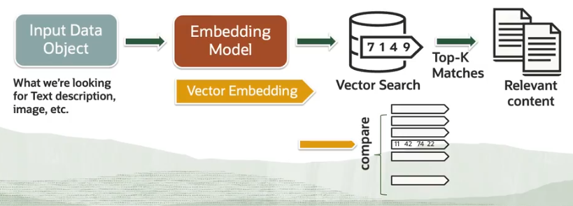

# Embedding Models

Vecto embeddings are created by **embedding models** to represent the unstructured data.

The ```VECTOR_EMBEDDING()``` function allows you to generate vectors within the database. It supports the **Open Neural Net Exchange (ONNX)** framework.

```
-- 1) Import the model

DBMS_DATA_MINING.IMPORT_ONNX_MODEL (
    model_name => "All-MiniLM-L6-v2",
    model_data => "All-MiniLM-L6-v2.onnx"
)

-- 2) Use the model

SELECT VECTOR_EMBEDDING(All-MiniLM-L6-v2 USING incident_text)
  FROM supporting_incidents  
```

