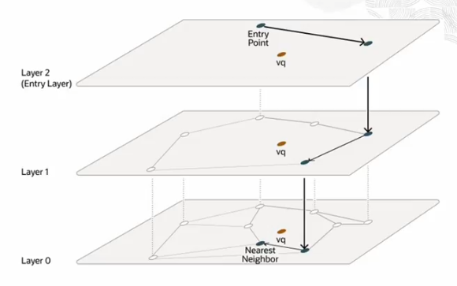
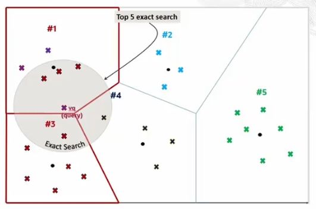
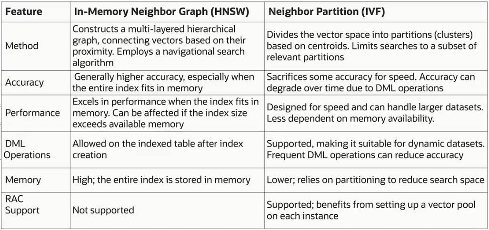
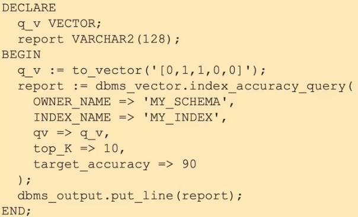

# Vector Indexes And Memory

**Vector Indexes** are specialized indexing data structures that can make your queries more efficient against your vectors. They are designed for similarity search in high-dimensional vector space. Without indexes, searching would require comparing against every vector.

Vector Indexes use these techniques to *drastically* reduce the search space:
- Clustering
- Partitioning
- Neighbor Graphs

**NOTE. They do require that you enable the Vector Pool in the SGA.**

## Types of Vector Indexes

Oracle AI Vector Search supports two types of indexes:
- **In-Memory Neighbor Graph Vector Index**
    - Hierarchical Navigable Small World (HNSW) is the only type supported
    - HNSW are very efficient for vector approximate similarity search
    - In a RAC environment you cannot create HNSW index
    - Store in memory (SGA) 
    - Best choice when data fits in memory
    - After a database restart **HNSW indexes must be rebuilt!**
- **Neighbor Partition Vector Index**
    - Inverted File Flat (IVF) Index is the only type supported
    - They balances high search quality with reasonable speed
    - Better suited for larget datasets
    - Supports DML operations

**NOTE. You can only create one type of vector index per vector column.** 

### Example 1 (HNSW)

Immagine highways (upper layers) connecting major cities and local roads (lower layers) for detailed navigation. HNSW starts the search on "highways" to quicly get close to the target, the uses "local roads" for precise results.



### Example 2 (IVF)

Think of a libraray with books organized by subject (partitions). If you're looking for a specific topic, you only need to search the relevant section, not the entire library.



## Vector Pool Area

The Vector Pool is a memory area in the System Global Area (SGA) designed to HNSW vector indexes and associated metadata. 

It is configured using the ```VECTOR_MEMORY_SIZE``` parameter. It can be modified at CDB level (Container Database) or PDB level (Pluggable Database).

```ALTER SYSTEM SET VECTOR_MEMORY_SIZE=1G SCOPE=BOTH;```

**Note.**    Large vector indexes do need lots of RAM and RAM constrains the vector index size. You should use IVF indexes when there is not enough RAM. IVF index is used both the buffer cache as well as disk.


## Memory Considerations

The size of a vector depends upon the embedding model that you use to create those embeddings. 

Most popular vectors are between 1.5 and 12 KB in size.

Oracle AI Vector Search supports:
- INT8
- FLOAT32
- FLOAT64

Oracle AI Vector Search supports vectors with up to 65535 dimensions.

### Example

In this example, we're using the FLOAT32 format, which is 4 bytes in size. The size would be the number of dimensions multiplied by how many bytes for that format.


## Indexes Memory Size

In-Memory Neighbor Graph Indexes are stored:
- On-Disk
- In-Memory

The In-Memory size formula is:

    (1.3) * (size of vector format) * (# of dimensions) * (# of rows)

*NOTE: 1.3 is an approximation for the overhead and graph layers*


## Creating a HNSW index

HNSW parameters:
- ```NEIGHBORS```
    - max connections per vector (1-2048)
- ```EFCONSTRUCTION```
    - number of closest vector candidates considered during each step of HNSW index creation (1-65535)
    - a high value improves accuracy but can increase creation time
- ```TARGET ACCURACY``` 
    - desired accuracy percentage (0-100)
    - a value of 90 means the algorithm aims for 90% accuracy while balancing speed

```
CREATE VECTOR INDEX galaxies_hnsw_idx 
    ON galaxies (embedding)
    ORGANIZATION INMEMORY NEIGHBOR GRAPH 
    DISTANCE COSINE 
    WITH TARGET ACCURACY 95
    PARAMETERS (TYPE HNSW, NEIGHBORS 40, EFCONSTRUCTION 500);
```

## Creating a IVF index

IVF parameters:
- ```NEIGHBOR PARTITIONS```
    - number of centroid partitions
    - a high value allows the algorithm to search more partitions, leading to higher accuracy
- ```SAMPLE_PER_PARTITION```
    - training sample size
- ```TARGET ACCURACY``` 
    - desired accuracy percentage (0-100)
    - a value of 95 means the algorithm aims for 95% accuracy while balancing speed

```
CREATE VECTOR INDEX galaxies_ivf_idx 
    ON galaxies (embedding)
    ORGANIZATION NEIGHBOR PARTITIONS 
    DISTANCE COSINE 
    WITH TARGET ACCURACY 95
    PARAMETERS (TYPE IVF, NEIGHBOR PARTITIONS 100);
```

## HNSW indexes vs IVF indexes



## Using Vector Indexes

- Must use ```APPROX``` or ```APPROXIMATE``` keyword
- Distance function **must match index**
- All vectors must have same dimensions

Note. If the distance metric used in a query differs from the one specified during index creation, the system performs an exact match instead of using the vector index.

```
  SELECT name
    FROM galaxies
   WHERE name <> 'NGC1073'
ORDER BY VECTOR_DISTANCE (embedding, to_vector('[0,1,1,0,0]', COSINE)
   FECTH APPROXIMATE FIRST 3 ROWS ONLY;
```

## Monitor Index Accuracy

