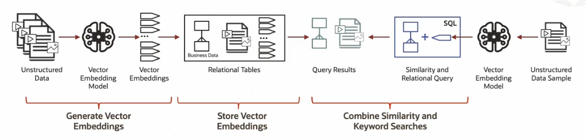
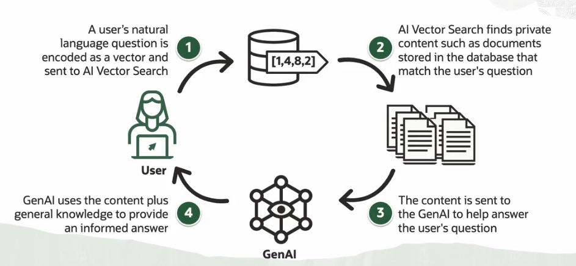

# Retrieval Augumented Generation (RAG)

Retrieval Augmented Generation (RAG) is a technique that allows us to enhance the capabilities of LLMs providing them relevant context from external knowledge sources. This will allow the LLMs to generate more accurate, informative, and context-aware responses.

RAG real world applications:
- Answering questions
- Chatbot development
- Content summarization
- Knowledge discovery

**Oracle Database 23ai includes native functionality**, allowing built-in tools and packages specifically designed for RAG pipeline development.

## RAG Workflow

1. **Generate Vector Embeddings** 
    - You start from unstructured data
    - You use vector embedding models
    - You can generate those embeddings either inside or outside of the DB
2. **Store Vector Embeddings**
    - You store the vector embeddings and associated unstructured data 
    - (Optional) You create vector indexes
3. **Combine Similarity and Keyord Searches**
    - You can use Oracle AI Vector Search native SQL operations
4. **RAG inference**
    - You can generate a prompt and send it to a LLM
    

## RAG Application

